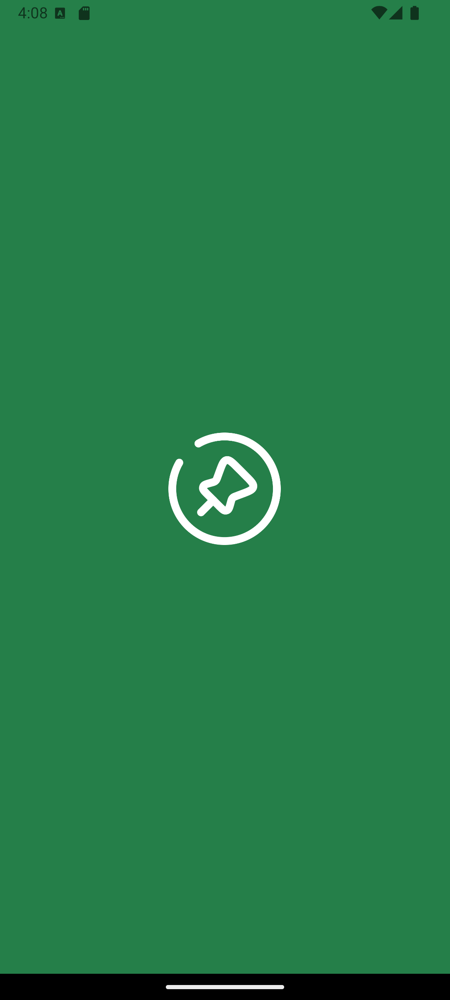
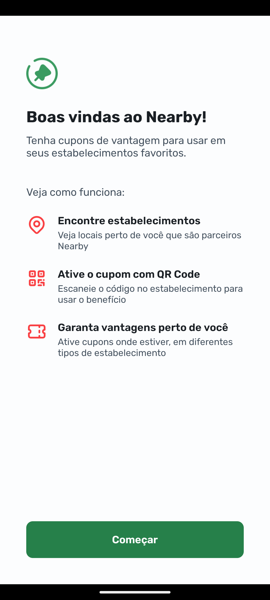
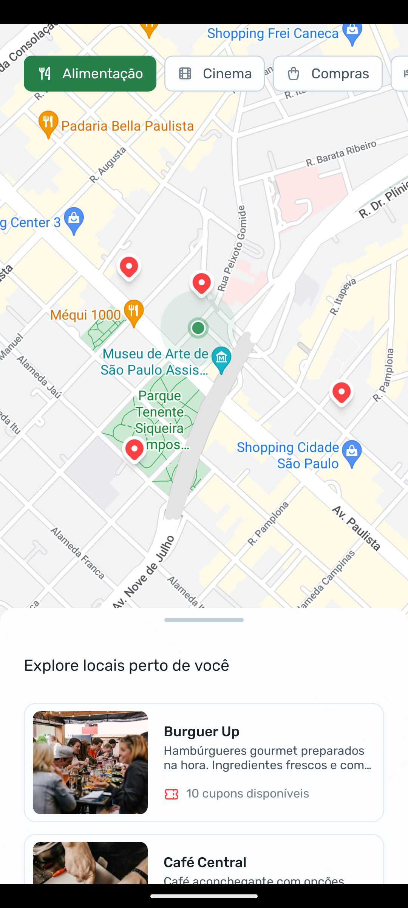
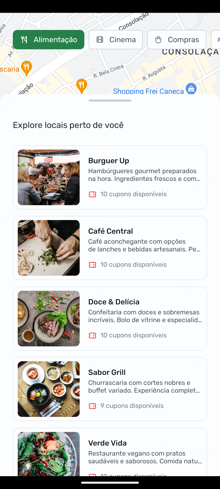
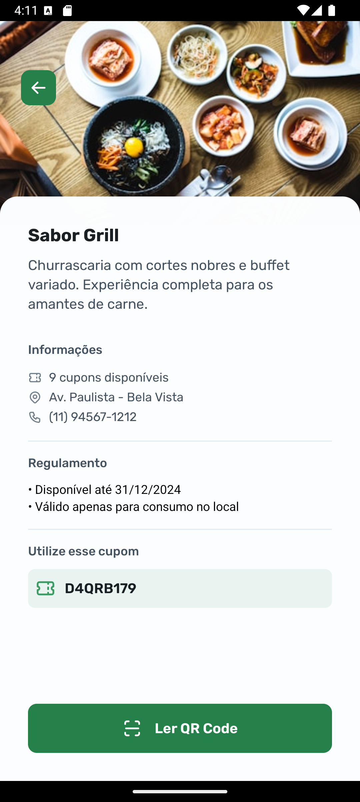
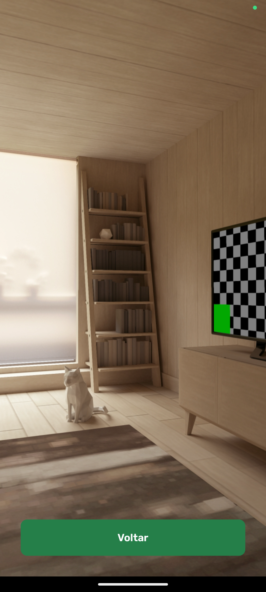

# Nearby App

nlw-pocket was promoted by [RocketSeat](https://www.rocketseat.com.br/)

## Overview

The **Nearby App** is the ultimate solution for discovering nearby establishments and unlocking exclusive deals. Designed with convenience and user experience in mind, this app empowers users to explore their surroundings and benefit from special discounts offered by partner establishments.

## Why Choose Nearby App?

-  **Discover Easily:** Locate the best establishments near you with a user-friendly map.
-  **Save More:** Gain access to exclusive coupons and discounts.
-  **Tailored for You:** Filter results by categories like clothing, food, and entertainment.

## Features

### 1. **Home Screen**

-  Simple and intuitive instructions to guide first-time users.

### 2. **Map View**

-  Interactive map showing:
   -  Your current location.
   -  Nearby partner establishments.
-  Powerful filters to find what you need quickly:
   -  Clothing
   -  Food
   -  Entertainment
   -  And more.

### 3. **Establishment Details**

-  Get detailed insights about each establishment.
-  Unlock deals with the QR scanner:
   -  Scan the QR code at the establishment to redeem exclusive discounts.

## Technologies Used

-  **React Native**: Ensures a seamless and fast mobile experience.
-  **Expo Router**: Simplifies navigation.
-  **react-native-maps**: Provides an interactive and dynamic map view.

## Screenshots and Video

Check out a full video demonstration of the app in action: [YouTube - Nearby App Demo](https://youtube.com/shorts/bKtk-a0BONY)

